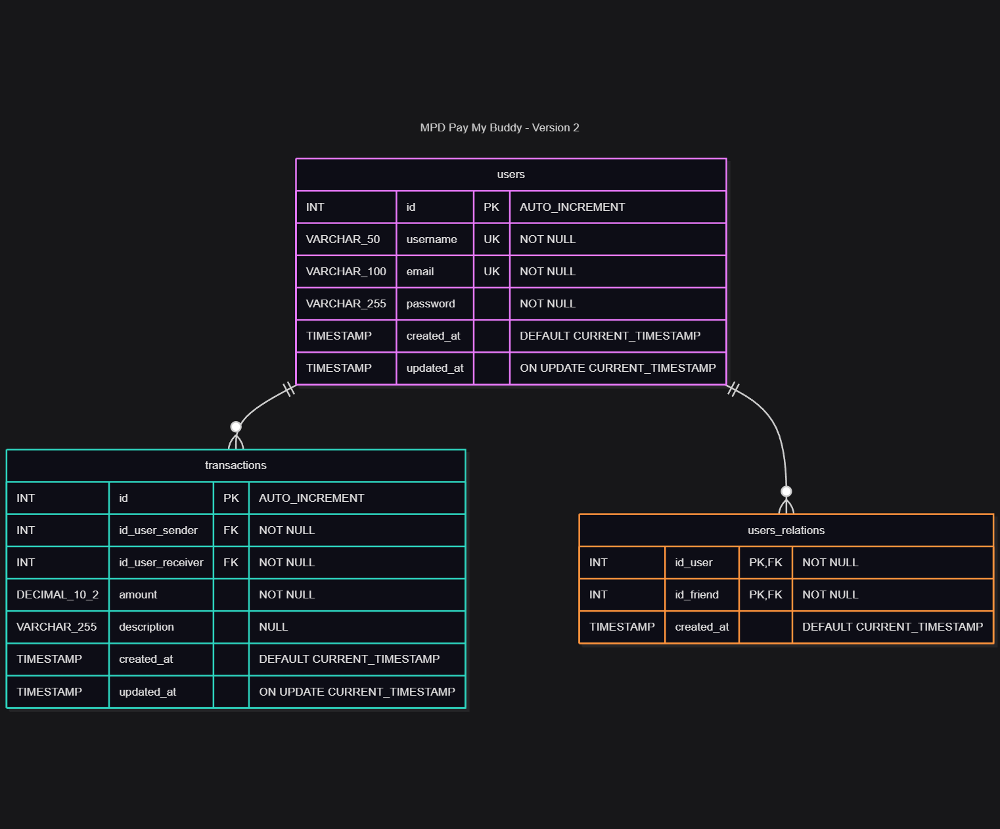

# OpenClassrooms - Cursrus Dev Java #
Ce projet à été créé dans le cadre de ma formation **Développeur d'application Java** dispensée par [OpenClassrooms](https://openclassrooms.com/)

## Contexte
> ### Étudiant  : **Franck Mounier** ###
> ### Projet : P6 - Concevez une application web Java de A à Z ###
> ### Type : Livrable ###
> #### Repo source : empty project ####
> #### Date de démarrage du projet : 01/01/2026 ####

## Modèle Physiquue de Données (MPD)




## Prérequis

- **Java 25+**
- **Maven 3.9+**
- **MySQL 8+**

## Installation de la base de données

1. Exécuter le script SQL :
   ```
   src/main/resources/SQL/paymybuddy_V2.sql
   ```

2. Créer un utilisateur MySQL `buddy` avec accès à la base `paymybuddy`, ou modifier les credentials dans `application.properties`

3. Infos : Lors de l'éxecution du script SQL, une liste d'utilisateurs tests sont créés permettant d'utiliser la fonction d'ajout de relation et de transfert simplement:
   ```
   1. username : 'user1' - email : 'user1@gmail.com' - password : 'user'
   2. username : 'user2' - email : 'user2@gmail.com' - password : 'user'
   3. username : 'user3' - email : 'user3@gmail.com' - password : 'user'
   ```

## Configuration

Fichier `src/main/resources/application.properties` :

```properties
spring.datasource.url=jdbc:mysql://localhost:3306/paymybuddy
spring.datasource.username=buddy
spring.datasource.password=<votre_mot_de_passe>
```

## Lancement

```bash
mvn spring-boot:run
```

L'application est accessible sur `http://localhost:8080`

## Tests

```bash
mvn test
```

Rapport de couverture JaCoCo : `target/site/jacoco/index.html`
